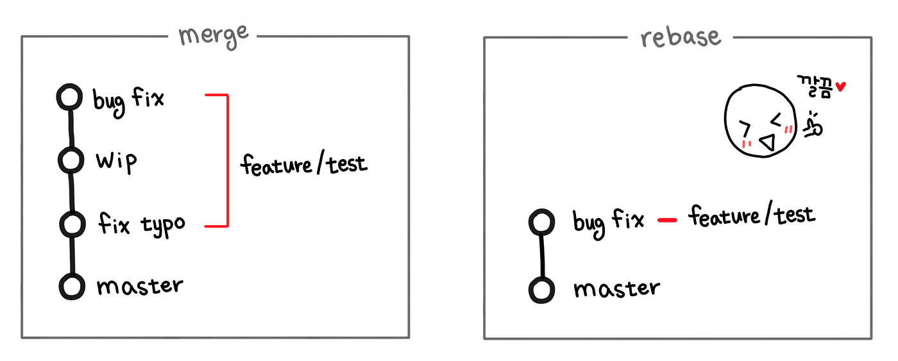

## Jekyll을 사용하여 GitHub Pages 배포 및 테마적용

> 사전 준비

- Ruby 설치
- Jekyll 설치
- 테마 선택
  - [jamstackthemes.dev](http://jamstackthemes.dev)
  - [http://jekyllthemes.org/](http://jekyllthemes.org/)
- 코드블럭 선택
  - [https://spsarolkar.github.io/rouge-theme-preview/](https://spsarolkar.github.io/rouge-theme-preview/)
    <br/>

> 배포 및 테마 적용하기

1. github repository 생성

   - repository명은 github 아이디.github.io로 생성할 것
   - repository는 public 으로 할 것
   - ex) parklego.github.io

2. bundle 명령어 실행

   ```
   bundle install
   bundle exec jekyll serve
   ```

3. 블로그 설정
   - \_conif.yml 파일에서 제목이나 이름 등을 변경
   - Gemfile 플러그인 설치하는 곳

## siteamp 파일 생성

1. Gemfile 파일에서 아래 코드 추가

   ```
   gem 'jekyll-sitemap'
   ```

2. \_config.yml 파일에서 아래 코드 추가

   ```
   plugins:
      -jekyll - sitemap;
   ```

3. Terminal 에서 `bundle` 입력.
4. Terminal 에서 아래 명령어 입력

   ```
   gem install jekyll-sitemap
   ```

5. 지킬 서버 재실행

   ```
   bundle exec jekyll serve
   ```

## commit 깔끔하게 남기기

main branch에 다른 branch를 병합할 때, 쓰이는 방법은 두 가지이다.

하나는 merge, 그리고 다른 하나는 rebase이다. 이 둘의 가장 큰 차이는 깔끔함에 있다.



merge를 사용하면 모든 commit을 남기게 되지만, rebase를 사용하면 필요없는 commit을 생략시킬 수 있다.

<br/>

> 예제를 통해 알아보기

<br/>

1. 첫 작업을 완료 후 아래와 같이 commit을 남겼다.

   ```
   git add .
   git commit -m '테스트 추가'
   ```

2. 두 번째 작업을 완료 후 아래와 같이 commit을 남겼다.

   ```
   git add .
   git commit -m '테스트 추가 2'
   ```

3. 세 번째 작업을 완료 후 아래와 같이 commit을 남겼다. 그리고 해당 작업이 끝나서 push를 해야하는 상황이다.

   ```
   git add .
   git commit -m '테스트 추가 3'
   ```

4. commit을 정리하기 전에 git log를 통해 몇 개의 commit을 정리할지 파악한다.

   여러 날에 걸쳐서 작업된 경우에는 몇 개의 commit을 했는지 파악하기 힘들기 때문이다.

   ```
   git log
   ```

5. push 하기 전에 rebase로 불필요한 commit을 정리할 수 있다.

   ```
   git rebase -i @~3

   // -i는 --interactive 옵션이고 대화형으로 진행한다는 뜻이다.
   // @~3은 root(최근)를 기준으로 3개의 commit을 rebase하겠다는 뜻이다.
   // HEAD~3과 같은 뜻이다.
   ```

6. rebase 편집 화면. i를 눌러 수정모드에서 7번 과정처럼 변경한다.

   ```
   pick 74cd541 test 추가
   pick a6d2a9f test 추가 2
   pick e5e93ab test 추가 3
   # Rebase 83ffc92..e5e93ab onto 83ffc92
   #
   # Commands:
   #  p, pick = use commit
   #  r, reword = use commit, but edit the commit message
   #  e, edit = use commit, but stop for amending
   #  s, squash = use commit, but meld into previous commit
   #  f, fixup = like "squash", but discard this commit's log message
   #  x, exec = run command (the rest of the line) using shell
   #
   # These lines can be re-ordered; they are executed from top to bottom.
   #
   # If you remove a line here THAT COMMIT WILL BE LOST.
   #
   # However, if you remove everything, the rebase will be aborted.
   #
   # Note that empty commits are commented out
   ```

7. 편집을 하고 :wq로 vi를 빠져나온다.

   ```
   pick 74cd541 test 추가
   s a6d2a9f test 추가 2   // pick -> s (squash)
   s e5e93ab test 추가 3   // pick -> s (squash)
   # Rebase 83ffc92..e5e93ab onto 83ffc92
   #
   # Commands:
   #  p, pick = use commit
   #  r, reword = use commit, but edit the commit message
   #  e, edit = use commit, but stop for amending
   #  s, squash = use commit, but meld into previous commit
   #  f, fixup = like "squash", but discard this commit's log message
   #  x, exec = run command (the rest of the line) using shell
   #
   # These lines can be re-ordered; they are executed from top to bottom.
   #
   # If you remove a line here THAT COMMIT WILL BE LOST.
   #
   # However, if you remove everything, the rebase will be aborted.
   #
   # Note that empty commits are commented out
   ```

8. 그 다음 vi로 commit을 수정할 수 있게 된다.

   ```
   # This is a combination of 3 commits.
   # This is the 1st commit message:

   test 추가

   # This is the commit message #2:

   test 추가 2

   # This is the commit message #3:

   test 추가 3

   # Please enter the commit message for your changes. Lines starting
   # with '#' will be ignored, and an empty message aborts the commit.

   ...
   ```

9. 최종 commit 메세지를 수정하는 것이므로 그냥 다 삭제하고, commit 메세지를 작성한다.

   → shift + v로 블럭설정 모드로 들어간 뒤 shift + 커서로 모두 지정하고, dd를 눌러 삭제를 한다.

10. rebase 완료

    ```
    Successfully rebased and updated refs/heads/main.
    ```
