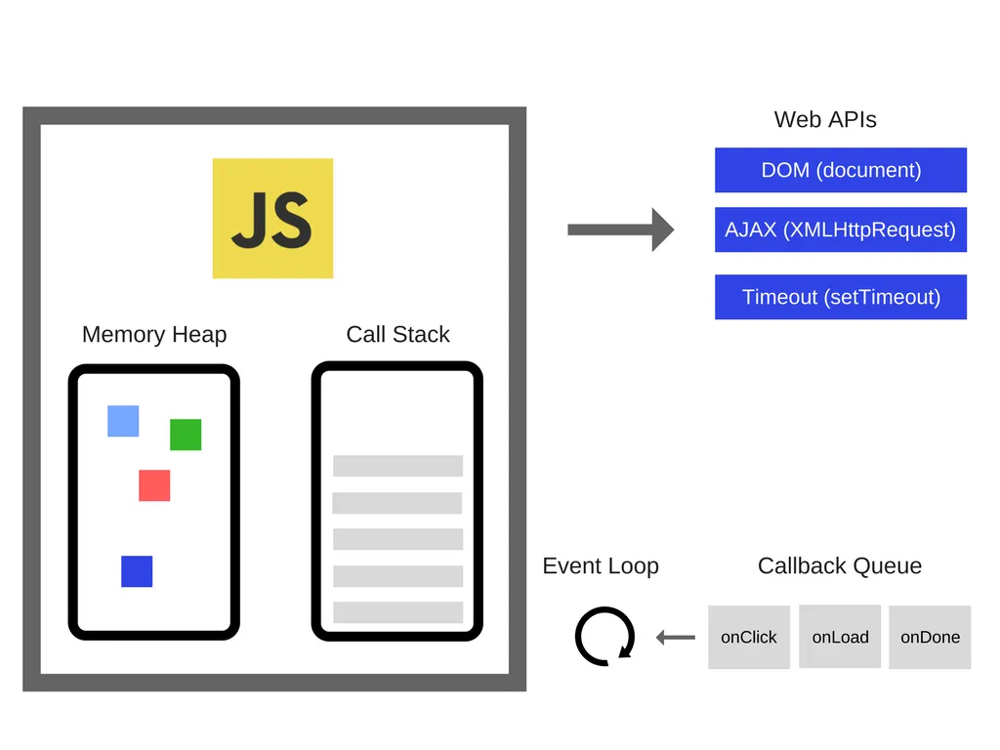

## 메서드

### for in

- 객체 순환

```javascript
let object = {
  a: 1,
  b: 2,
  c: 3,
};

// key 값 접근
for (let key in object) {
  console.log(key); // a,b,c
}

// value 값 접근
for (let key in object) {
  console.log(object[key]); // 1,2,3
}
```

### for of

- 배열 순환

```javascript
let array = [1, 2, 3];

for (let value of array) {
  console.log(value); // 1,2,3
}
```

### forEach

- 배열 순환
- return 값 X

```javascript
let array = [1, 2, 3];

array.forEach((value) => console.log(value)); // 1,2,3
```

### map

- 배열 순환
- return 값이 변형된 값(return값)들의 모음

```javascript
let array = [1, 2, 3];

let double = array.map((item) => {
  return item * 2;
});

console.log(double); // [1,2,3]
```

### filter

- 배열 순환
- return 값이 true인 값들의 모음

```javascript
let array = [1, 2, 3, 4];

let odd = array.filter((item) => {
  return item % 2;
});

console.log(odd); // [1,3]
```

### reduce

- 배열 순환
- callback함수의 실행 값을 누적하여 하나의 결과값을 반환
- 초기값 설정 필요 (설정하지 않으면 배열 0번째 요소의 값)

```javascript
const numbers = [1, 2, 3, 4, 5, 6, 7, 8, 9, 10];

const sum = numbers.reduce((acc, curr) => {
  return acc + curr;
}, 0);

console.log(sum); // 55
```

### split

- 문자열을 구분자 기준으로 나누어 배열로 변환

```javascript
const str = "apple banana orange";

const arr = str.split(" ");

console.log(arr); // [ 'apple', 'banana', 'orange' ]
```

### join

- 배열의 모든 요소를 쉼표나 지정된 구분 문자열로 구분하여 연결한 새 문자열을 만들어 반환

```javascript
const elements = ["Fire", "Air", "Water"];

console.log(elements.join()); //  Fire,Air,Water
console.log(elements.join("")); // FireAirWater
console.log(elements.join("-")); // Fire-Air-Water
```

### toSorted

- 요소들을 오름차순으로 정렬한 새로운 배열을 반환

### toReversed

- 요소들을 내림차순으로 정렬한 새로운 배열을 반환

## Nullish coalescing

- 값이 null 이나 undefined 인지 체크

```javascript
const displayName = name ?? "익명";
```

## 호이스팅

호이스팅(Hoisting)이란, var 선언문이나 function 선언문 등을 해당 스코프의 선두로 옮긴 것처럼 동작하는 특성을 말한다.

자바스크립트는 ES6에서 도입된 let, const를 포함하여 모든 선언(var, let, const, function, function\*, class)을 호이스팅한다.

<br/>

아래는 가장 대표적인 예시이다.

```javascript
console.log(a); // undefined

var a = 1;
```

선언하지 않은 것인데도 에러가 발생하지 않는다.

```javascript
helloWorld(); // Hello World!

function helloWorld() {
  console.log("Hello World!");
}
```

선언을 하지도 않았는데 함수에 접근할 수 있다.

<br/>

<b>왜 그런 것일까??</b>

자바스크립트에서의 변수는 `선언 단계` > `초기화 단계`> `할당 단계`에 걸쳐 생성되는데 컴파일 단계에서 함수와 변수 선언이 스캔된다.

<br/>

스캔 된 모든 함수, 변수 선언은 `Lexical Environment`라고 불리는 자바스크립트 데이터 구조 내 메모리에 추가된다.

(이때가 스코프의 선두로 옮긴 것처럼 동작하게끔 보이는 것이고 접근 가능케 되는 것이다. )

<br/>

```javascript
console.log(a); // ReferenceError: Cannot access 'greeting' before initialization

const a = 3;
```

가끔 다른 블로그를 보면 `let` 과 `const`가 호이스팅이 안된다고 말하는 사람들이 있는데 그것은 잘못 된 것이다.

<br/>

`var`는 선언 단계와 초기화 단계가 한번에 이루어진다. 그래서 `undefined`가 찍히는 것이다.

반면,`let`과 `const`는 호이스팅이 되어 선언단계까지는 왔으나 초기화 단계가 없어서 에러를 뱉는 것이다.

위의 주석처리를 보면 이제 이해가 갈 것이다. 이때를 `일시적 사각지대(Temporal Dead Zone; TDZ)`에 빠진다고 생각하면 된다.

## 클로저

클로저를 쉽게 이해하기 위해서는 배경지식이 필요하다.

먼저, `실행 컨텍스트`를 알아야한다.

함수는 호출 될 때 함수의 실행 컨텍스트가 생성됐다가 실행이 끝나면 실행 컨텍스트가 종료된다.

이때 실행 컨텍스트의 `lexical environment`에는 함수의 지역 변수의 정보와 이 함수의 상위 스코프의 대한 정보가 들어있다. (`scope chain`)

<br/>

<b>클로저란?</b>

함수가 생성 될 때 주변 환경의 상태를 기억하여(lexical environment) 나중에 호출될 때 그 값에 접근할 수 있는 것을 말한다.

예제를 보자면,

```javascript
function makeCounter() {
  let count = 0;

  function inner() {
    count++;
    return count;
  }

  return inner;
}

let counter = makeCounter();

console.log(counter()); // 1
console.log(counter()); // 2
console.log(counter()); // 3
```

이 코드에서 makeCounter 함수는 inner 함수를 정의하고, 이를 반환한다.

inner 함수는 외부 함수인 makeCounter 함수 내에 정의되어 있지만, 외부 변수인 count에 접근할 수 있다.

이렇게 반환된 inner 함수가 클로저이다.

이제 counter 변수에는 inner 함수가 할당되어 있고, 이를 호출할 때마다 count 변수가 증가한다.

<br/>

<b>정리</b>

클로저 (Closure) 함수는 외부 함수 밖에서 내부 함수가 호출 되더라도 외부 함수의 지역 변수에 접근할 수 있다 그 이유는 자신이 생성될 때의 환경 즉, Lexical Environment을 기억하고 있기 때문이다.

## 이벤트 루프

JavaScript는 단일 스레드 프로그래밍 언어이다. 즉, 단일 호출 스택이 있음을 의미한다.
그러므로 한 번에 한 가지 일만 할 수 있다.



JavaScript는 크게 `Memory Heap`과 `Call Stack`으로 이루어져 있다.

- Memory Heap : 메모리 할당이 일어나는 장소
- Call Stack : 코드가 실행될 경우 하나씩 stack의 형태로 쌓이는 장소

<br/>

Call Stack에서 실행된 비동기 함수는 `Web API`에서 처리를 하게 되고, 그동안에 Call Stack은 나머지 동기 함수들을 처리하게 된다.

<br/>

Web API는 브라우저(Chrome)에서 멀티 스레드로 구현되어 있다. 그래서 브라우저는 비동기 작업에 대해 메인 스레드를 차단하지 않고, 다른 스레드를 사용하여 동시에 처리할수 있는 것이다. (DOM, AJAX, setTimeout 등)

작업이 완료된 비동기 함수들을 `Callback Queue`로 넘겨주게 된다.

<br/>

`Event Loop`는 Call Stack과 Callback Queue를 상태를 계속 감시하며 Call Stack에 함수들이 존재하지 않는다면 Callback Queue에 있는 비동기 함수들을 Call Stack에 밀어 넣게 된다.

그 후 Call Stack에서 비동기 함수를 실행시키게 된다.

<br/>

참고 : https://inpa.tistory.com/entry/%F0%9F%94%84-%EC%9E%90%EB%B0%94%EC%8A%A4%ED%81%AC%EB%A6%BD%ED%8A%B8-%EC%9D%B4%EB%B2%A4%ED%8A%B8-%EB%A3%A8%ED%94%84-%EA%B5%AC%EC%A1%B0-%EB%8F%99%EC%9E%91-%EC%9B%90%EB%A6%AC

참고 : https://blog.toktokhan.dev/t-767eb0fa38f3
