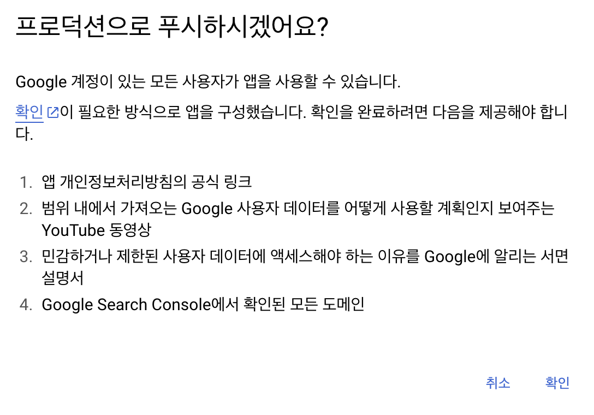

## 라이트/다크 모드

최근에 create-react-app을 더 이상 사용하지 않는다는 소식을 들었다. 그래서 다음에는 vite를 이용해보고자 했는데 드디어 사용해보게 되었다.

새로 해보는 만큼 라이브러리도 써보지 않은 다양한 것을 사용해보고 싶었다. 그래서 shadcn도 설정하였다.

설정하는 단계가 조금 귀찮다. 그리고 문서가 자세하지가 않다. 그렇지만 이쁘다.

그리고 상태관리로는 최근에 가장 가파른 상승세를 타고 있는 zustand를 사용해보기로 했다.

처음에 해보고 싶었던 것은 라이트/다크모드를 설정해보는 기능을 구현해보고 싶었다.

localstorage를 이용해서 구현할 것이고, styled-component의 `themeProvider`로 구현하고자 하였다.

그런데 zustand에 localstorage가 있었다. 그래서 persist middleware와 함께 이용하기로 했다.

shadcn의 switch 컴포넌트를 이용해 토글기능으로 다크모드를 on/off 하였다. 그러다 ux측면도 고려해보게 되었다.

내가 주로 검색하는데 사용하는 phind와 shadcn의 다크모드 기능을 살펴보았다.

- phind의 경우에는 처음에 os의 테마를 바탕으로 사이트를 변경해준다. 이때 localstorage에는 테마의 키-벨류가 없다. 그리고 유저가 테마를 건드리면 그때 키-벨류값이 생기고 이에따라 테마가 변경된다.
- shadcn의 경우 처음부터 라이트/다크/시스템 이렇게 선택할 수 있게 설정이 되어 있다.

다크모드 구현이 단순한 기능인줄 알았는데 생각보다 다양한 방법도 있다는 것을 알았다. UX도 생각보다 빠르게 발전하고 있구나 싶었다.

os 테마변경에 따른 실시간 변경을 위해 커스텀훅을 만들어서 구현하였다.

## 인터렉티브

프론트엔드 개발자라면 인터렉티브한 웹사이트를 보게되면 이벤트를 발생시켜보면서 어떻게 구현했나? 궁금하고 신기해 한다. 간혹 채용 공고의 우대사항에서도 three.js 사용해본 경험이라던지 R3F에 대한 내용이 더러 있다.

언젠가는 애플과 같은 (스크롤을 감지하여 배경화면을 랜더링) 이쁘고 깔끔한 개발을 해보고 싶다는 생각이 있었는데 최근에 다양한 기술로 가볍게 만들어본 프로젝트의 배경이 생각이 났다. 그래서 three.js를 찍먹이나 해보자는 생각으로 시도를 해보았다.

아래는 우와! 소리가 절로 나올만한 사이트들이다.

> 드래그를 하면 마우스를 추적하여 꽃이 피어오른다.
>
> [Nomadic Tribe — makemepulse](https://2019.makemepulse.com/)

> 30종류의 동물들이 조각형태로 변환되는 것을 보여준다.
>
> [In Pieces – 30 Species, 30 Pieces. 1 Fragmented Survival.](http://species-in-pieces.com/#)

<br/>

그 외에 해외에서 다양한 인터렉티브한 사이트들을 한눈에 볼 수 있는 사이트이다. UI도 깔끔하고, 다양한 아이디어들을 볼 수 있어서 좋은 것 같다.

1. [CSS Design Awards - Website Awards - Best Web Design Inspiration - CSS Awards](https://www.cssdesignawards.com/)

2. [https://thefwa.com/awards/page/1/](https://thefwa.com/awards/page/1/)

<br/>

찍먹이기에 나는 모델이 마우스 커서를 주시하여 움직이는 정도로만 구현해보고자 했다.

어느정도의 개념적인 부분은 아래에 블로그를 참고 하였고, 내가 구현한 코드를 설명하자면

```javascript

...

const sensitivity = 1000;

useEffect(() => {
    const handleMouseMove = (event: MouseEvent) => {
      setMousePosition({
        x: event.clientY / sensitivity,
        y: event.clientX / sensitivity,
      });
    };

    window.addEventListener("mousemove", handleMouseMove);

    return () => {
      window.removeEventListener("mousemove", handleMouseMove);
    };
  }, []);

  useFrame((state, delta) => {
    meshRef.current.rotation.x = mousePosition.x;
    meshRef.current.rotation.y = mousePosition.y - 1000;
  });

...


```

@react-three/fiber에서 제공하는 useFrame을 사용하여 매 프레임마다 rotation되게 하면 모델을 움직일 수 있게 할 수 있을 것 같았다.

그러기 위해서 마우스의 움직임을 추적해야하는데 이를 위해 handleMouseMove 라는 함수를 만들어 주었다. (useFrame은 애니메이션을 처리하거나 실시간으로 변화하는 값을 관리할 때 주로 사용한다.)

마우스를 좌,우(x축)로 움직였을 때 모델이 위아래로 움직였고 상,하로 움직였을 때 모델이 좌우로 움직였다.

그래서 포지션을 반대로 해주면 될 것 같았다. 그러나 너무 빠르게 움직여서 미친듯이 움직였다. 그래서 민감도를 주기 위하여 그 값을 큰 값으로 나누어서 값의 크기를 줄였더니 원하는대로 움직였다.

하지만 내가 개발한 페이지에서 모델은 오른쪽에 배치를 했기 때문에 가용범위를 고려하여 실제 회전을 할 때에 y값에 -값을 추가해보면서 자연스러운 값을 찾았다.

Canvas 위에 Mesh라는 Object를 얹는다는 느낌으로 이해하면 된다. 3D 모델은 아래의 사이트에서 찾아서 불러왔다.

[https://sketchfab.com/feed](https://sketchfab.com/feed)

## JWT 적용기

> 사전 준비

1. cookie parser
2. cors
   - origin 설정
   - credentials true

<br/>

> JWT 로직

- 로그인 시 인증 서버로부터 access token, refresh token을 쿠키에 넣어서 보내준다.

  (중요) refresh token은 httpOnly / secure / SameSite 옵션을 준다.

  ```javascript
  {
    maxAge: 300000, // 5m
    httpOnly: true,
    secure: true,
    sameSite: "strict"
  }
  ```

- 인증 체계를 다음과 같이 만든다.

  1.  쿠키에 엑세스토큰이 있는지 확인한다.

      - 엑세스 토큰이 없다면 엑세스토큰을 재발급 절차를 받는다. (2번으로 이동)
      - 엑세스 토큰 있다면 엑세스토큰을 확인 절차를 밟는다. (종료)

  2.  재발급을 받는 절차에서 리프레시 토큰을 확인한다.
      - 리프레시 토큰이 없거나 유효하지 않으면 로그인 페이지로 이동시킨다. (종료)
      - 리프레시 토큰이 유효하다면 새로운 엑세스토큰을 발급해준다.

<br/>
<br/>

token의 저장 위치에 관하여는 언제나 말이 많았다. 예전에 나는 localstorage에 저장해서 이번에는 cookie에 한 번 담아 본 것이다.

리액트같은 경우에 access token을 private 변수로 저장해놓고 사용해도 된다고 한다. 왜냐하면 어차피 refresh token이 있으니까 재발급받으면 된다는 의미인 것 같았다.

refresh token을 일회성으로 사용하는 RTR (Refresh Token Rotation)이라는 방법도 있다.

그러고 보니 access token을 헤더에 실어 보낼 때 어떻게 했더라 싶어서 다시 찾아봤다.

```javascript
const accessToken = localStorage.getItem("accessToken") || "";

const requestData = {};

axios.post("http://localhost:8000/like", requestData, {
  headers: {
    Authorization: `Bearer ${accessToken}`,
    "Content-Type": "application/json",
  },
});
```

아. 그리고 Bearer를 항상 붙였었는데 이건 일종의 약속이라서 그렇다고 한다.

`Authorization: <type> <credentials>`

Bearer 타입은 JWT 혹은 OAuth에 대한 토큰을 사용한다는 뜻.

## Next oAuth를 이용하여 Youtube API 호출하기

처음의 나의 로직은 이러했다.

1. next-auth를 이용하여 소셜로그인을 한다.
2. 로그인 도중 oAuth 인증을 통해서 자격증명을 사용자에게 요청한다.
3. 자격증명에 성공하면 Youtube API 접근 권한에 대한 access token을 획득한다.
4. 클라이언트에서 Youtube API를 호출할때 header에 access token을 실어서 넘긴다.

```ts
// app/api/auth/[...nextauth]/route.ts

import NextAuth from "next-auth";
import GoogleProvider from "next-auth/providers/google";

const handler = NextAuth({
  providers: [
    GoogleProvider({
      clientId: process.env.GOOGLE_CLIENT_ID ?? "",
      clientSecret: process.env.GOOGLE_CLIENT_SECRET ?? "",
      authorization: {
        params: {
          scope:
            "openid email profile https://www.googleapis.com/auth/youtube.readonly",
          prompt: "consent",
          access_type: "offline",
          response_type: "code",
        },
      },
    }),
  ],
  pages: {
    error: "/",
  },
  callbacks: {
    async jwt({ token, account }) {
      if (account) {
        token.accessToken = account.access_token;
      }
      return token;
    },
    async session({ session, token, user }) {
      session.accessToken = token.accessToken;

      return session;
    },
  },
});

export { handler as GET, handler as POST };
```

테스트를 해보니 내가 구독한 정보에 대해 잘 불러왔다.

하지만, 문제점은 프로덕션 단계에서 이를 활용하려면 아래와 같이 조건들이 필요했다.



저러한 조건을 다 채우더라도 승인될지의 의문과 구독한 채널의 카테고리를 필터링해서 불러오는 API의 부재로
이는 포기하고 API key로 Youtube API를 호출하는 방식으로 바꿔야 할 듯 하다.
